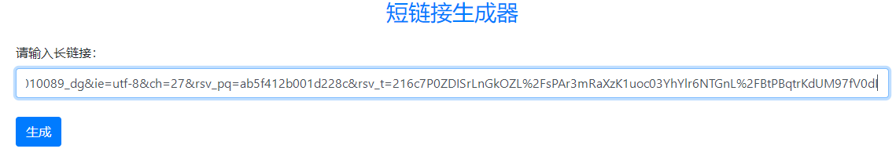

# shorturl_generator 短地址生成器

## 1.功能说明

这个小网站的功能便是把很长的地址转化为一个短地址，起到方便转发的作用。

所用到的技术栈：Python+Flask+html+MySQL。

实例：输入```https://www.baidu.com/s?wd=The%20current%20Flask%20app%20is%20not%20registered%20with%20this%20%27SQLAlchemy%27%20instance.%20Did&pn=10&oq=The%20current%20Flask%20app%20is%20not%20registered%20with%20this%20%27SQLAlchemy%27%20instance.%20Did&tn=98010089_dg&ie=utf-8&ch=27&rsv_pq=ab5f412b001d228c&rsv_t=216c7P0ZDISrLnGkOZL%2FsPAr3mRaXzK1uoc03YhYlr6NTGnL%2FBtPBqtrKdUM97fV0dI```



点击生成，得到的输出如下：


点击短链接立刻成功转到长链接对应的页面。

## 2.实验说明

### 2.1.概览

这个作业是一个典型的```Flask```框架，我也采用的是经典的布局：

- `app.py`是主程序，里面是获取长链接页面和生成短链接页面的相关代码，通过GET和POST的方法实现前后端的联系；
- `config.py`是`Flask`项目的配置文件，主要是数据库的连接信息；
- `models.py`是自己撰写的类，里面设计了url在数据库中的表单形式，此外还设计了两个获取数据的方法；
- `exts.py`专门用来存放`SQLAlchemy`的实例，这样做的原因见下文。
- `index.html`是基于bootstrap的app页面，简洁美观。

大致的思路便是通过将网页的序号（在数据库里的序号）通过62进制函数形成一一对应并且缩短长度，再在本网页设置重定向即可。运作流程可以概括为：**用户输入长链接->数据库存储长链接并且生成序号->(点击短链接时)通过短链接后缀找到序号，找到数据库中对应的长链接->跳转**。

### 2.2作业中设计的类

> `models.py`

```python
from exts import db
class URLModel(db.Model):
    #数据表信息设置
    __tablename__ = "urls"
    id = db.Column(db.Integer, nullable=False, autoincrement=True, primary_key=True)
    url = db.Column(db.String(1000), nullable=False)
    #通过id找到对应url
    def find_url(self, id):
        url = URLModel.query.filter(URLModel.id == id).first().url
        return url
    #获取当前最后一个数据（即刚刚存储的数据）的id
    def find_id(self):
        return URLModel.query.order_by(URLModel.id.desc()).first().id
```

这个类先设计了url在数据库中的表单形式：id是url对应的序号，为整型变量，是整个table的主键并且有自增；url为字符串变量，存放用户输入的长url。`Flask-SQLAlchemy`提供一个名为 Model 的类，用于作为声明模型时的 declarative 基类。在这之后我设计了两个简单的方法，分别用数据库的语句查询到相应的信息，从而简化了主程序的代码。`find_url`通过输入id返回对应的url，`find_id`的作用是查询数据表最后一行对应的id。这个类的设计至关重要，因为主程序绝大多数功能都要调用这个类。

### 2.3实验中的问题及难点

- （这个问题到现在还没解决）Python的虚拟环境问题。这个app分别在pycharm terminal跑和在进入虚拟环境的cmd上跑，用的包位置不一样。后面就统一在terminal里面跑得了。

- （最坑爹的bug）

  `The current Flask app is not registered with this 'SQLAlchemy' instance.`

  为了解决这个报错，我先改变了代码的结构，新增了`exts.py`专门用来存放`SQLAlchemy`的实例，这样比较符合`Flask`的文件规范，也可以有效防止同时构建多个实例导致报错。然而报错仍然存在。搞了好几个小时才发现`app.py`中的初始化语句`app = Flask(__name__)`写了两遍！系统会觉得我创建了重复的实例就报错了。

- （各种小bug）

  - 下包失败，原因是我一开始挂了梯子，得关掉。
  - 要下载的库是`bases.py`而我一开始下载的是`bases`。正确的语句是`pip3 install bases.py`。
  - 数据库连不上，后面修改了配置文件就成功了。
  - 设计的函数返回值的类型错误，这是小失误，很快解决。
  
- （难点）其实每个模块单独来看真的不难，对我来说最难的部分就是这个项目技术栈之间的联系，比如说`Flask`和`MySQL`的联系；app与网页的联系；表单和数据库的联系等等。这往往是最容易出bug的地方。

### 2.4界面布局

见小视频。

## 3.我的收获和总结

首先我debug的能力得到了提升。在写程序的过程中，我遇到了很多的bug。如今一些小的bug我很快就能解决，但是一些较大的问题，我往往需要很久才能克服，不过好在我最终都克服了。这是这个程序虽小，但是给我带来成就感最大的地方。在此之外，我觉得我的代码能力得到了提升。因为在此之前我没有独立的写过Python的类，更没有一个人独自完成过前后端的开发。还有就是，我会使用git了，这确实给我的版本控制带来了极大的方便。通过这次大作也让我对Python，`Flask`，命令行，虚拟环境，版本控制，网页和数据库有了初步的认识，我觉得自己收获很大！